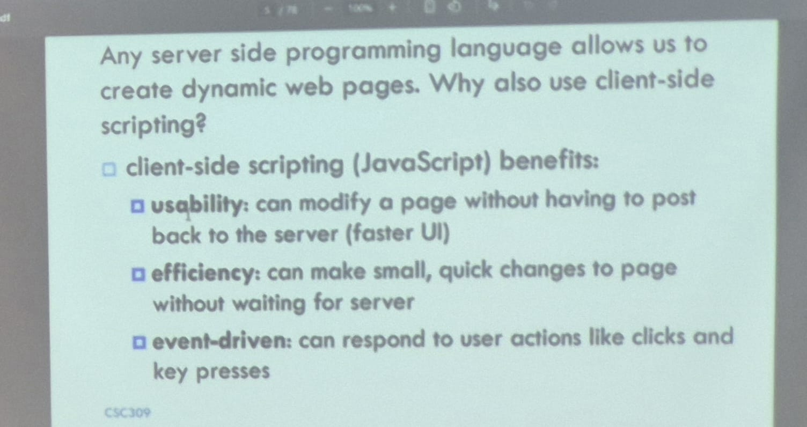
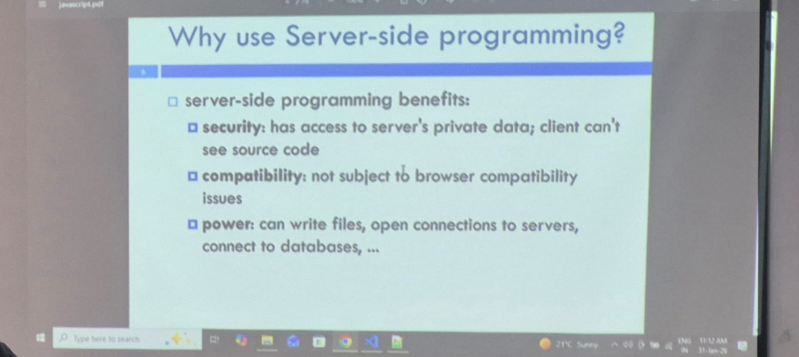

## MERN
M :- Mongo DB
E :- Express JS
R :- React JS
N :- Node JS
## Why Client side scripting?

## Server side benifits:

  ##  What is JS?
  a lightweight programming languages

  ## Data Types:-
  Primitive Data Types :
  1. String 
  2. Number
  3. Boolean
  4. Undefined
  5. null
  6. BigInt
  7. Symbol

  Complex Data Types
  1. Object:- {key:"value",anotherkey:"value2"};
  2. Array=[1,23,5]
  3. function()
